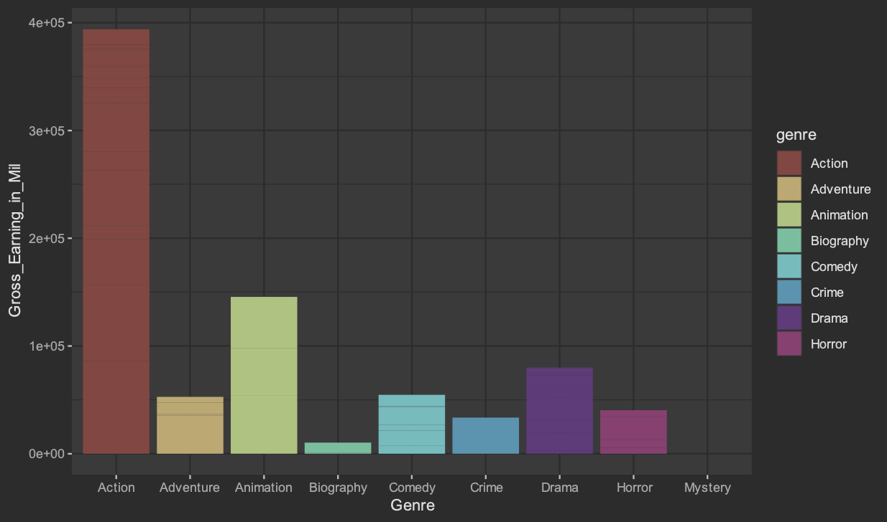

# imdb_web_scraping_R
web scraping [tutorial](https://www.analyticsvidhya.com/blog/2017/03/beginners-guide-on-web-scraping-in-r-using-rvest-with-hands-on-knowledge/) with R and GGplot2.

Can be used to make a number of analyses, including this simple graph showing which genres earn the most money at the box office:

 
